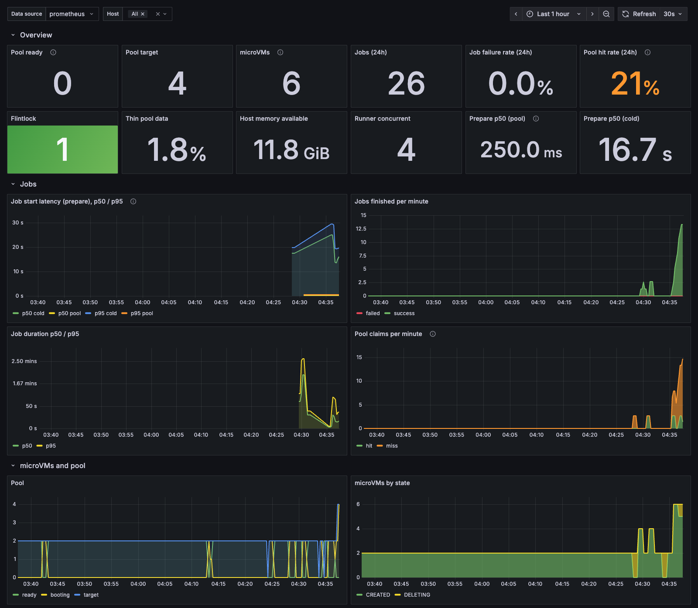
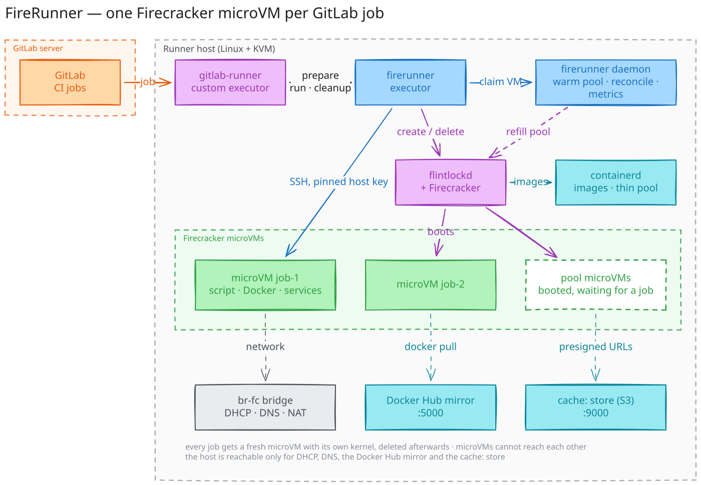
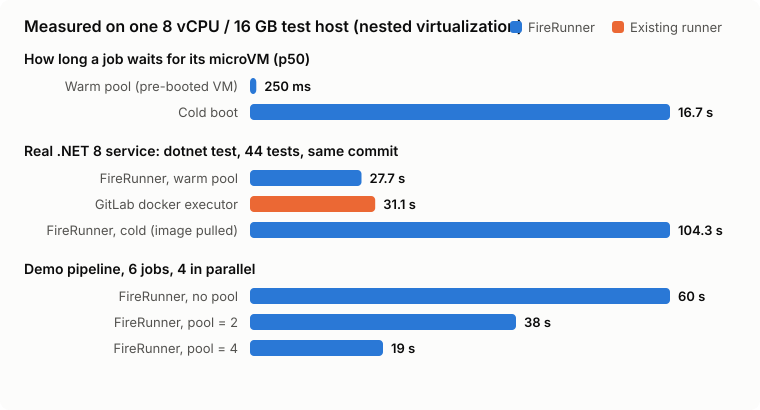
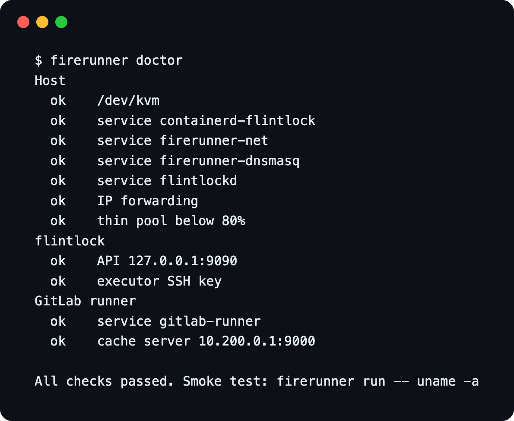

# FireRunner

Every GitLab CI job in its own fresh Firecracker microVM, on your own hardware.

[](https://github.com/ismoilovdevml/firerunner/actions/workflows/ci.yml)
[](https://github.com/ismoilovdevml/firerunner/releases/tag/edge)
[](LICENSE)
[](https://ismoilovdevml.github.io/firerunner/)

**Documentation: <https://ismoilovdevml.github.io/firerunner/>** — user guide for engineers writing
`.gitlab-ci.yml`, and an operator guide (install, configuration, capacity, monitoring, troubleshooting).

FireRunner is a [GitLab Runner custom executor](https://docs.gitlab.com/runner/executors/custom/).
gitlab-runner picks up jobs as usual; for each job FireRunner hands out a clean microVM
(its own kernel, root filesystem, Docker daemon and network identity), runs every stage of
the job inside it, and deletes it when the job ends. Nothing survives between jobs.

A daemon keeps a small pool of pre-booted microVMs, so a job normally gets its VM in
**~0.3 s** instead of a 15-17 s cold boot.



## How it works



1. **prepare**: claim a pre-booted VM from the daemon (or boot one), record it for the job.
2. **run**: every stage script is streamed into the VM over SSH. With `image:` the job's
   own scripts run in that container inside the VM, like the docker executor.
3. **cleanup**: the VM is deleted. The daemon refills the pool.

Host stack: containerd (devmapper thin pool), Firecracker, [flintlock](https://github.com/liquidmetal-dev/flintlock),
dnsmasq, nftables, a Docker Hub pull-through cache, an S3 store for `cache:`, gitlab-runner.
Guest: FireRunner's 6.18 LTS kernel and Ubuntu 24.04 with Docker CE (buildx, compose), git and gitlab-runner.

## Measured



Measured on one test host (8 vCPU, 16 GB, a VMware VM with nested virtualization), same
commit, same pipeline, jobs of the same project run side by side:

| | FireRunner | Existing runner |
|---|---|---|
| Job waits for its VM (p50) | **0.25 s** warm pool, 16.7 s cold | n/a |
| `dotnet test`, 44 tests, `image: mcr.microsoft.com/dotnet/sdk:8.0` | **27.7 s** (warm pool, image preloaded) | 31.1 s (docker executor) |
| Same job, cold VM, image pulled | 104.3 s | |
| Same `dotnet test`, NuGet packages in `cache:` | **25.5 s** (32.4 s without) | 23.4 s (docker executor) |
| `docker build` of the same service | 24.6–31 s | 1–2.4 s (shell executor, warm layer cache) |
| Same build, BuildKit cache in `cache:` | build 10–11 s + 8 s cache transfer | |
| 6-job demo pipeline | 60 s without pool, 38 s with pool 2, **19 s** with pool 4 | |

The `docker build` rows are the price of isolation: a shell or docker runner reuses the
host's layer cache between jobs, a FireRunner job starts from a clean VM and has to bring
its cache along.

## Requirements

- x86_64 Linux host with `/dev/kvm`: bare metal, or a VM with nested virtualization
  (VMware: *Expose hardware assisted virtualization to the guest OS*).
- systemd, a blank disk for the microVM thin pool (100 GB+ recommended).
- Tested on **Rocky Linux 9.6** (SELinux enforcing, firewalld). The installer supports
  Debian/Ubuntu too, but that path has not been run end to end yet.
- GitLab 16+ (new runner token flow). Tested with GitLab CE 19.0.

## Install

```bash
curl -sfL https://raw.githubusercontent.com/ismoilovdevml/firerunner/main/install.sh | sudo bash
```

It installs and verifies (sha256) every component, creates the thin pool on the first blank
disk, sets up the microVM network and starts the services. Re-running it is safe: files are
only rewritten when they change and running microVMs are not touched.

| Variable | Default | |
|---|---|---|
| `FR_DISK` | first blank disk | disk for the thin pool (wiped) |
| `FR_POOL_SIZE` | `2` | pre-booted microVMs |
| `FR_METRICS_ALLOW` | none | CIDR allowed to scrape `:9477` (otherwise metrics stay on 127.0.0.1) |
| `FR_GITLAB_URL`, `FR_RUNNER_TOKEN` | none | register the runner during install |
| `FR_RUNNER_CONCURRENT` | `4` | parallel jobs |
| `FR_VERSION` | `edge` | FireRunner release (`edge` = latest `main`) |
| `FR_BRIDGE`, `FR_SUBNET` | `br-fc`, `10.200.0` | microVM network |



## Connect GitLab

1. In GitLab: **Settings > CI/CD > Runners > New project runner** (or group/instance).
   Tags: `firecracker`; leave *Run untagged jobs* off.
2. On the host:

   ```bash
   firerunner runner register --url https://gitlab.example.com --token glrt-...
   ```

3. In `.gitlab-ci.yml`:

   ```yaml
   test:
     tags: [firecracker]
     image: mcr.microsoft.com/dotnet/sdk:8.0   # optional: runs the job in this container
     script:
       - dotnet test

   build:
     tags: [firecracker]
     script:
       - docker build -t app .                 # Docker is available in every VM

   integration:
     tags: [firecracker]
     image: python:3.12
     services: [postgres:16]                   # runs in the job VM, reachable as "postgres"
     script:
       - pytest
   ```

## Operate

```text
firerunner status | doctor                 host, pool, runner state and checks
firerunner config show | set <key> <value> tune without restarting
firerunner pool [refresh]                  pre-booted VMs; refresh after a new rootfs image
firerunner vm list | rm <id> | logs <id>   microVMs and their console logs
firerunner run -- <command>                throwaway microVM, e.g. a smoke test
firerunner upgrade [--version vX.Y.Z]      self-update (checksum verified), restarts the daemon
firerunner -v
```


Common settings (`/etc/firerunner/config.yaml`):

| Key | Default | |
|---|---|---|
| `vm.vcpu`, `vm.memory_mb` | `2`, `2048` | size of every job VM |
| `pool.size`, `pool.max_idle` | `2`, `30m` | warm pool; idle VMs are replaced after `max_idle` |
| `pool.preload_images` | none | images pulled into pool VMs in advance (Docker's mirror only covers Docker Hub) |
| `vm.host_reserve_mb` | `1024` | memory kept free; boots wait instead of overcommitting |
| `vm.docker_bip`, `vm.docker_address_pool` | `10.201.0.1/24`, `10.202.0.0/16` | guest Docker networks (kept off `172.17.0.0/16`) |
| `vm.rootfs_image`, `vm.kernel_image` | see `config show` | guest images |
| `daemon.metrics_listen` | `127.0.0.1:9477` | Prometheus endpoint |

Upgrades: push to `main` publishes the `edge` release, then `firerunner upgrade` on the host.
The warm pool survives daemon restarts and upgrades.

## Monitoring

Prometheus metrics on `:9477/metrics`: pool size and hit rate, job start latency (pool vs
cold), job results and duration, VM boot time and failures, orphans cleaned up, thin pool
usage, host memory, service health. A Grafana dashboard and alert rules are in
[`deploy/`](deploy/).

## Security model

- One microVM per job, deleted afterwards; pool VMs are never reused.
- Jobs cannot reach each other: frames between microVM taps are dropped on the bridge.
- Jobs reach the host only for DHCP, DNS, the image cache and the `cache:` store (IPv4 and IPv6
  filtered); `cache:` is per project and jobs only get presigned URLs.
- Each VM gets its own SSH host key, generated by the host and pinned: job scripts and
  secrets are only sent to the VM that was created for the job.
- flintlockd listens on 127.0.0.1 and its token is in a root-only config file, never in argv.
- Memory admission: VMs are only booted when their memory is available, so a busy host
  queues jobs instead of running out of memory.
- Everything the installer and `upgrade` download is checksum-verified.
- Release binaries carry a signed build provenance and an SBOM:
  `gh attestation verify firerunner-linux-amd64 --repo ismoilovdevml/firerunner`.

A source-level audit with [cloudflare/security-audit-skill](https://github.com/cloudflare/security-audit-skill)
found no confirmed vulnerability; its four open leads are fixed as described above.

## Limitations

- x86_64 only.
- No shared Docker layer cache between jobs (by design): keep BuildKit's cache in `cache:` or a
  registry, and use `pool.preload_images` for base images.
- Tested on Rocky Linux 9.6 hosts only.

## Development

```bash
make build test lint vulncheck
```

## License

Apache 2.0
