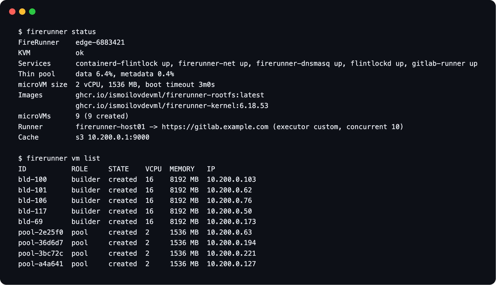
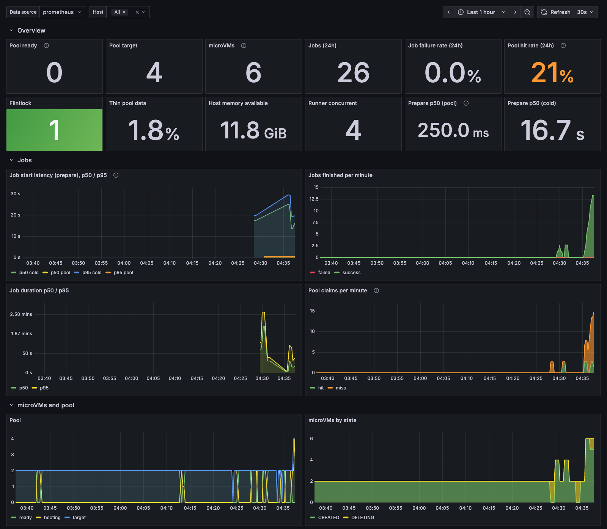

# FireRunner

[](https://github.com/ismoilovdevml/firerunner/actions/workflows/ci.yml)
[](https://github.com/ismoilovdevml/firerunner/releases)
[](https://ismoilovdevml.github.io/firerunner/)
[](LICENSE)

FireRunner runs every GitLab CI job in its own [Firecracker](https://firecracker-microvm.github.io/)
microVM on your own Linux hosts. Each job gets a fresh machine with its own kernel, root filesystem
and Docker daemon, and the machine is deleted when the job ends. Nothing one job does can affect
the next one.

It plugs into GitLab as a [custom executor](https://docs.gitlab.com/runner/executors/custom/) of
the standard gitlab-runner, so pipelines keep working as they are: `image:`, `services:`, `cache:`,
artifacts and `docker build` behave like on the shell and docker executors. A daemon keeps a few
microVMs booted ahead of time, and each project gets a builder that keeps its Docker layer cache
between jobs.


## Why

Shared CI runners trade isolation for speed. A shell executor runs every project's jobs on one host
with one Docker daemon, so jobs see each other's files, images and processes. The docker executor
separates jobs into containers, but they share a kernel, and building images needs privileged
Docker-in-Docker or the host's Docker socket.

FireRunner gives every job a virtual machine boundary instead:

- **Isolation**: every job has its own kernel, file system and Docker daemon. A job cannot see
  another job's files, processes, images or secrets, and cannot reach another job's microVM on the
  network.
- **A clean machine every time**: the microVM is deleted when the job ends, so no job depends on
  what an earlier one left behind, and none can leave something for the next.
- **Docker builds without privileges**: `docker build` needs no privileged Docker-in-Docker and no
  host Docker socket. Each project's layer cache stays with that project.
- **Your own hardware**: jobs run on your hosts, next to your internal registries and services,
  including behind a corporate proxy.

## Getting started

You need an x86_64 Linux host with KVM (bare metal, or a VM with nested virtualization), a blank
disk for microVM storage and GitLab 16 or newer.

```bash
curl -sfL https://raw.githubusercontent.com/ismoilovdevml/firerunner/main/install.sh | sudo bash
sudo firerunner runner register --url https://gitlab.example.com --token -   # paste the glrt-... token
sudo firerunner doctor
```

Then send a job to the runner's tag:

```yaml
test:
  tags: [firecracker]
  image: node:22
  services: [postgres:16]
  script:
    - npm test
```

`firerunner status` shows the host at a glance:



## Documentation

The documentation is at **[ismoilovdevml.github.io/firerunner](https://ismoilovdevml.github.io/firerunner/)**:

- [Install](https://ismoilovdevml.github.io/firerunner/install/): requirements, installation, connecting GitLab
- [Writing jobs](https://ismoilovdevml.github.io/firerunner/jobs/): for engineers who write `.gitlab-ci.yml`
- [Configuration](https://ismoilovdevml.github.io/firerunner/configuration/) and [Operations](https://ismoilovdevml.github.io/firerunner/operations/): sizing, upgrades, monitoring, troubleshooting
- [Corporate networks](https://ismoilovdevml.github.io/firerunner/corporate-network/): HTTP proxy, company CA, internal registries
- [How it works](https://ismoilovdevml.github.io/firerunner/how-it-works/): architecture and security model
- [Reference](https://ismoilovdevml.github.io/firerunner/reference/): CLI commands, metrics, limits

## Status

FireRunner is young. It runs the CI of a team of about 25 projects in a production trial, at up to
about 600 jobs a day. It supports x86_64 hosts running Rocky Linux 9 or Ubuntu 24.04, and Linux jobs.

Isolation has a cost: jobs take longer than on a shell executor, whose one host keeps every
project's images and layers at hand. Each job starts from a clean microVM, and a `docker build`
may wait for its project's builder to start and load its cache.

Prometheus metrics and a Grafana dashboard ([`deploy/`](deploy/)) show pool hits, job start
times, boots and host health:



## Development

You need Go, at the version in `go.mod`, and shellcheck for `make check`.

```bash
git clone https://github.com/ismoilovdevml/firerunner
cd firerunner
make build        # build/firerunner
make check        # fmt, vet, go.mod tidy, golangci-lint, shellcheck, govulncheck, tests
```

| Directory | |
|---|---|
| `cmd/firerunner` | the single binary: CLI, daemon and executor |
| `internal/` | executor, daemon, microVM and host code |
| `images/` | guest kernel and root filesystem images |
| `install.sh` | host installer |
| `deploy/` | Grafana dashboard and Prometheus alert rules |
| `docs/` | the documentation site |

Every push to `main` publishes the `edge` release; hosts update with `firerunner upgrade`.

## Contributing and security

Bug reports and pull requests are welcome; see [CONTRIBUTING.md](CONTRIBUTING.md). Please report
security issues privately, as described in [SECURITY.md](SECURITY.md).

## License

Apache License 2.0, see [LICENSE](LICENSE).
