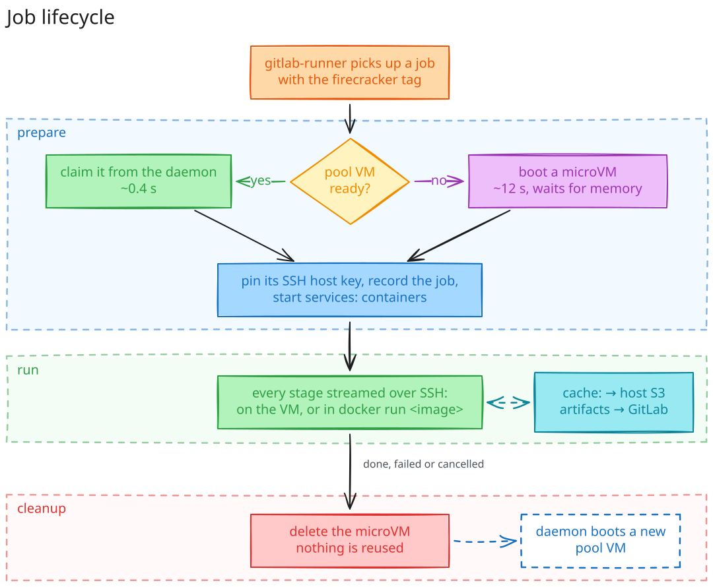

# Architecture

## Components

| Component | What it does |
|---|---|
| **gitlab-runner** | polls GitLab for jobs; with the custom executor it calls `firerunner executor prepare / run / cleanup` |
| **firerunner executor** | gets a microVM for the job, streams each stage script into it over SSH, deletes it |
| **firerunner daemon** | keeps the warm pool, deletes orphaned VMs (reconcile), exports metrics, serves a root-only unix socket |
| **flintlockd** | creates and deletes Firecracker microVMs from OCI images (kernel + root filesystem) |
| **containerd** | stores the images; root disks are devmapper thin-pool snapshots (copy-on-write) |
| **Firecracker** | the VMM: one process per microVM, KVM-backed |
| **dnsmasq / nftables** | DHCP and DNS for microVMs, NAT to the outside, host and inter-VM isolation |
| **registry** | Docker Hub pull-through cache for Docker inside the VMs |
| **versitygw** | S3 store for gitlab-runner's `cache:`; jobs get presigned URLs only |
| **builder microVMs** | one BuildKit VM per GitLab project (own CA, mTLS); `docker build` in jobs runs there and keeps the layer cache; job VMs reach it via a host port, never VM to VM |

## Job lifecycle

## Why a custom executor and not webhooks

gitlab-runner already solves job pickup, retries, artifacts and cancellation. As a custom executor
FireRunner only has to provide machines, and a job can never land in a VM that was created for
another job.

## Ownership and reconcile

flintlockd does not keep labels, so FireRunner encodes the role in the VM id: `pool-<random>`,
`job-<CI_JOB_ID>`, `run-<random>`. The daemon lists VMs every minute and deletes those that nothing
owns: failed VMs, pool VMs left by an earlier daemon run, job VMs without a running job, and
anything older than `daemon.job_max_age`. Idle pool VMs are recorded in `/run/firerunner/pool.json`
and adopted again after a restart.
