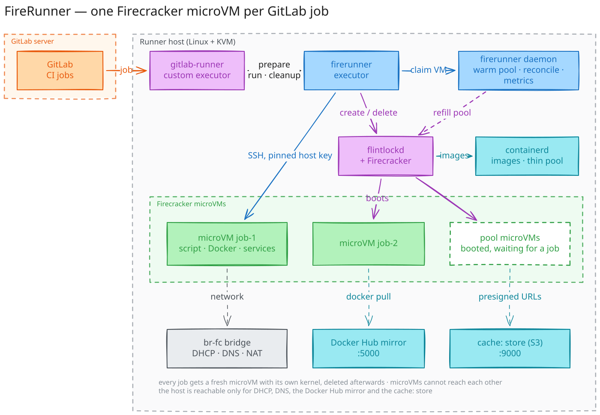
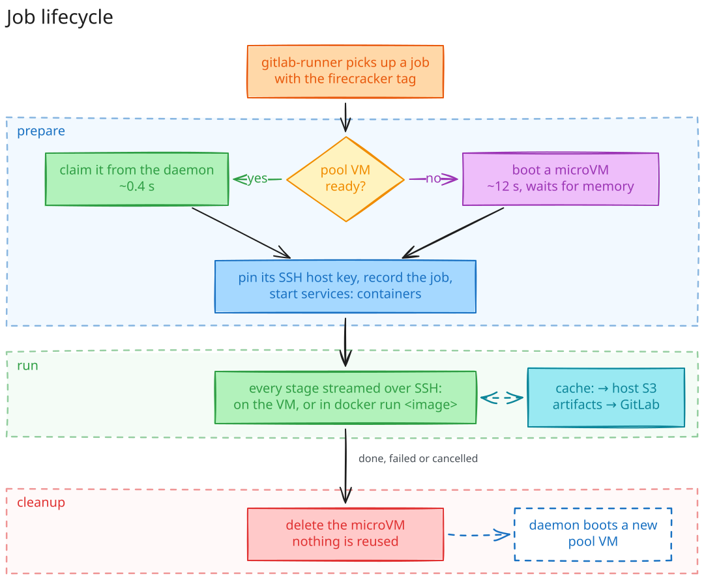

# How it works

gitlab-runner takes a job from GitLab and calls FireRunner three times:

1. **prepare** takes a pre-booted microVM from the daemon, or boots one.
2. **run** sends each stage script into the VM over SSH. With `image:`, the script runs in that
   container inside the VM.
3. **cleanup** deletes the VM. The daemon boots a replacement.

| Part | Job |
|---|---|
| firerunner daemon | keeps the pool and the builders, deletes VMs nobody owns, exports metrics |
| flintlock, Firecracker | create and run the microVMs; disks are copy-on-write snapshots |
| builder microVM | one per project; runs its `docker build` and keeps the layer cache |
| registry, versitygw | Docker Hub cache and `cache:` storage on the host |

The guest is Ubuntu 24.04 on a 6.18 LTS kernel built from Firecracker's config
([`images/`](https://github.com/ismoilovdevml/firerunner/tree/main/images)).

## Security

A job may run any code as root inside its own VM. It must not reach other jobs, the host's
control plane, or anything the next job will use.

| Boundary | Control |
|---|---|
| Job and job | a new VM with its own kernel per job, never reused; the host drops all traffic from one VM to another, on the bridge and routed through the host (a job reaches only its own project's builder, through the host); each VM's port on the bridge may only send from that VM's MAC and address, so a VM cannot take another one's address (ARP) or MAC |
| Job and host | the host accepts only DHCP, DNS, the Docker Hub cache and `cache:` storage from VMs; cloud metadata (`169.254.169.254`) is blocked; nothing a VM sends on its metadata interface (`eth0`) reaches the host |
| Network and job | hosts on your network cannot open connections to microVMs or to the services the host runs for them; microVMs only get replies to connections they opened |
| Project and project | each builder has its own certificate authority; a job gets a client certificate of its own for its project's builder only, valid for `daemon.job_max_age`. `cache:` is stored per project and reached through short-lived signed URLs |
| Host and VM | each VM gets its own SSH host key and every connection checks it, so scripts and secrets go only to the job's own VM. Job and project ids come from gitlab-runner, not from job variables |
| Local users | the microVM API listens on 127.0.0.1 with a token in a root-only file; with `flintlock.tls_ca_file` (and a client certificate) firerunner and flintlockd check each other's certificates, so a process that takes the API's port gets nothing. VM state files are root-only |
| Memory and disk | a VM starts only when its memory fits and the thin pool that holds VM disks has room; the console and Firecracker files of a VM are bounded |
| Supply chain | every download is checksum-verified; the checksums of firerunner releases are signed (Ed25519), and `firerunner upgrade` and the installer refuse a release whose signature is missing or does not verify, or whose binary is not the version asked for; releases have an SBOM and a signed provenance (`gh attestation verify firerunner-linux-amd64 --repo ismoilovdevml/firerunner`) |

Not covered yet:

- VMs can reach your LAN through NAT, like a docker executor. Block networks jobs must not reach
  with `FR_EGRESS_DENY` (install option).
- Firecracker runs as root without its jailer, which flintlock does not support: Firecracker's
  seccomp filters and KVM are the barrier between a VM and the host, and an escape from the VMM
  would be root on the host.
- A VM can send DHCP requests with made-up client ids from its own address and use up the
  addresses of the microVM network, so other jobs cannot start until those leases expire (15 min).
- A VM runs without its address binding when flintlock does not report its network port or nft
  refuses the binding; the daemon's next pass (every minute) binds it once flintlock reports the
  port. A deleted VM keeps its binding until its port is gone.
- The signature does not say which build of `edge` a release is: an older signed `edge` build can
  be served in place of the newest one. Tagged releases are checked (`v1.2.0` must say `v1.2.0`).

The code was audited with
[cloudflare/security-audit-skill](https://github.com/cloudflare/security-audit-skill); the findings
are fixed, except the points above.
