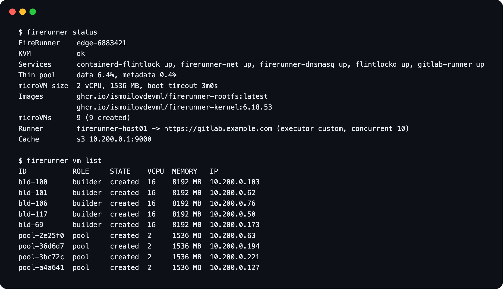

# Operations



## Health

```bash
sudo firerunner status     # one screen: services, disk, VMs, runner
sudo firerunner doctor     # every check, with a hint when one fails
```

## Upgrade

```bash
sudo firerunner upgrade            # latest build of main (edge)
sudo firerunner upgrade --version v1.2.0
```

The binary is checksum-verified and replaced in place. Running jobs, pre-booted VMs and builders
keep running. To upgrade the host stack (containerd, Firecracker, flintlock, gitlab-runner, network),
run the installer again.

After a new guest image is published, replace the idle VMs: `sudo firerunner pool refresh`.

To roll back, restore the previous binary and the `config.yaml` saved before the upgrade: an older
version refuses keys it does not know.

## microVMs

```bash
sudo firerunner vm list            # role: job, pool, builder or run
sudo firerunner vm logs <id>       # guest console, for boot problems
sudo firerunner vm rm <id>
sudo firerunner builder list
```

VMs that no job owns are deleted automatically every minute.

To drain a host, pause the runner in GitLab and wait until `vm list` shows no `job` VMs.

## Monitoring

Prometheus metrics are on `127.0.0.1:9477/metrics`. To scrape from elsewhere, install with
`FR_METRICS_ALLOW=<prometheus-ip>/32`.

Import the Grafana dashboard and the alert rules from
[`deploy/`](https://github.com/ismoilovdevml/firerunner/tree/main/deploy). Alerts page only for
failures FireRunner or the host caused, never for failing project scripts. Watch:

- **FireRunner failure rate** and **System failures by reason**.
- **Cold boots**: above 20 %, raise `pool.size` (if memory allows).
- **Host resources used**: the fullest host for thin pool, committed memory, DHCP leases and disk.
  A full thin pool or DHCP range stops every new microVM; full memory makes them wait.
- **Committed microVM memory** and **Jobs that waited over 30 s for memory**: jobs queue when
  memory is full.
- **Docker layer cache** row: builders against their slots, why builders were removed, and cache
  copies that fail or are skipped for lack of room.
- **Disk free**: the saved builder caches and flintlock's microVM state.
- **Flintlock errors**: failed flintlock calls by RPC and gRPC code.

The daemon logs one line per job (`journalctl -u firerunner | grep '"job":"<id>"'`).

Logs: `journalctl -u firerunner -u flintlockd -u gitlab-runner`.

## Alerts

Each rule in `deploy/prometheus/firerunner-alerts.yml` links to its section here. Names in
*italics* are panels of the Grafana dashboard.

### FireRunnerDaemonUnhealthy

Critical. The daemon is not scraped, or its main loop has not passed for 2 minutes. Jobs still
run, but every one cold-boots, nothing is cleaned up and the other FireRunner alerts are blind.

- Check: `journalctl -u firerunner -n 200`. Before restarting, check what the loop may wait on,
  which a restart does not fix: `systemctl status flintlockd` and
  `sudo timeout 10 lvs flintlock/thinpool` (a hang means LVM or the disk is stuck).
- Fix: `sudo systemctl restart firerunner`.
- Recovered: `curl -s 127.0.0.1:9477/healthz` on the host prints `ok`.

### FireRunnerFlintlockDown

Critical. The daemon has not reached the flintlock API for 3 minutes: no microVM can be created and
every new job fails in prepare.

- Check: `systemctl status flintlockd containerd-flintlock`, `journalctl -u flintlockd -n 100`,
  `sudo firerunner doctor`. flintlockd needs `containerd-flintlock`.
- Recovered: *Flintlock API* is up and the next job gets a microVM.

### FireRunnerServiceDown

Critical. `flintlockd`, `containerd-flintlock`, `firerunner-net`, `firerunner-dnsmasq` or
`gitlab-runner` has been inactive for 3 minutes: jobs fail (no microVM, network or DHCP) or are not
taken from GitLab.

- Check: `journalctl -u <service> -n 100`, `sudo firerunner doctor`.
- Fix: `sudo systemctl start <service>`. Never restart `firerunner-net` while jobs run: stopping it
  removes the bridge; its rules reload with `systemctl reload firerunner-net`.
- Recovered: *Services* shows it up.

### FireRunnerCacheServiceDown

Warning. `firerunner-registry` (the Docker Hub mirror) or `firerunner-cache` (`cache:` storage) has
been down for 10 minutes. Jobs still run, but pull from Docker Hub directly (rate limits) or start
without their `cache:`.

- Check: `journalctl -u <service> -n 100`, `df -h /var/lib/firerunner`.
- Fix: `sudo systemctl start <service>`.
- Recovered: *Services* shows it up.

### FireRunnerSystemFailures

Critical. In 30 minutes at least 3 jobs, and over 5 % of all jobs, failed because of FireRunner or
the host. Failing project scripts and cancelled jobs do not count.

- Check the `reason` in *System failures by reason*: `ssh_lost` a microVM died, usually a host OOM
  kill (see [FireRunnerHostOOMKill](#firerunnerhostoomkill)); `vm_boot` DHCP or the guest boot
  (`firerunner vm logs <id>`); `flintlock_error` flintlockd or the thin pool; `admission_timeout` no
  host memory (or a busy admission lock) within `vm.boot_timeout`; `services`, `docker_auth`, `helper_stage` the job log says
  which step. Per job: `journalctl -u firerunner | grep '"result":"system_failure"'`.
- Recovered: the alert resolves once fewer than 3 such failures are left in the last 30 minutes.

### FireRunnerJobsWaitForMemory

Warning. In 30 minutes at least 3 jobs, and over 10 % of prepared jobs, waited more than 30 s for
host memory before their microVM was created.

- Check *Committed microVM memory by role*: more `job` memory than the running jobs need means
  leaked VMs (`firerunner vm list`); a large `builder` share means `builder.max` or
  `builder.memory_mb` is too high.
- Fix: otherwise lower `concurrent` or `pool.size`, or add memory.
- Recovered: *Jobs that waited over 30 s for memory* stays at 0.

### FireRunnerHostOOMKill

Warning. The kernel OOM-killed a process in the last 10 minutes, usually a firecracker microVM:
its job failed with `ssh_lost`, or its builder died.

- Check what was killed and how large it was:
  `journalctl -k --since -15min | grep -iE 'out of memory|killed process'`.
- Fix: admission keeps microVM memory below MemTotal minus `vm.host_reserve_mb`, so the host needed
  more than that reserve: raise it (`sudo firerunner config set vm.host_reserve_mb <MB>`), or lower
  `concurrent`, `pool.size` or `builder.max`.
- Recovered: no new kill; the alert resolves 10 minutes after the last one.

### FireRunnerThinPoolFull

Warning. The devmapper thin pool that holds every microVM disk was over 85 % (data) or 75 %
(metadata) full at a reading in the last 15 minutes. At 100 % every microVM create fails; full
metadata can damage the pool.

- Check: `sudo lvs flintlock`; `firerunner vm list` for VMs that should be gone.
- Fix now: `sudo firerunner builder rm --all` frees the builder VMs' disks, but also deletes every
  project's saved layer cache, so every next build is cold.
- Fix for good: more space in the volume group (`vgextend flintlock <disk>`), then
  `lvextend -l +100%FREE flintlock/thinpool` for data or
  `lvextend --poolmetadatasize +<size> flintlock/thinpool` for metadata.
- Recovered: *Thin pool usage* is below the threshold; the alert resolves 15 minutes later.

### FireRunnerThinPoolUnknown

Warning. The daemon runs, but has not read the thin pool usage for 25 minutes, so
[FireRunnerThinPoolFull](#firerunnerthinpoolfull) cannot fire.

- Check on the host: `sudo timeout 10 lvs flintlock/thinpool`. An error or a hang means LVM or the
  disk is in trouble (`dmesg -T | tail -50`). The daemon logs its own `lvs` error:
  `journalctl -u firerunner | grep 'thin pool usage'`.
- Recovered: *Thin pool usage* shows data again.

### FireRunnerDHCPLeasesExhausting

Critical. Over 80 % of the microVM DHCP range has been leased for 5 minutes. At 100 % new microVMs
get no address and jobs fail with `got no DHCP lease`.

- Check *DHCP leases*: mostly `live` means that many microVMs exist (lower `concurrent` or
  `pool.size`); mostly `stale` means leases of deleted VMs are not released: install
  `dnsmasq-utils` (`dhcp_release`) and check `journalctl -u firerunner | grep 'delete failed'`.
- Recovered: *Host resources used* shows DHCP leases below 80 %.

### FireRunnerDiskFilling

Warning. The file system of `/var/lib/firerunner/builder-cache` or `/var/lib/flintlock/vm` has had
less than 15 % free for 15 minutes. Below 10 % no builder cache is saved; at 0 the registry mirror,
`cache:` uploads and flintlockd's microVM state can no longer be written.

- Check: `df -h /var/lib/firerunner /var/lib/flintlock/vm`;
  `sudo du -xsh /var/lib/firerunner/* /var/lib/flintlock/vm`.
- Fix: `cache:` archives: run the installer again with a lower `FR_CACHE_DAYS`. Saved builder
  caches: lower `builder.saved_cache_gb` (applies at the next save);
  `sudo firerunner builder rm --all` deletes every project's saved cache at once, so every next
  build is cold.
- Recovered: *Disk free* is above 15 % of the file system.

### FireRunnerBuildersFailing

Warning. In the last hour at least 3 builders failed to boot, stopped answering or lost their VM.
Those projects' `docker build` runs without the layer cache, or fails when its builder dies.

- Check: `journalctl -u firerunner --since -1h | grep -E 'builder boot failed|builder: (not answering|VM gone)'`.
- Fix: `no host memory for a builder` means builders do not fit next to the jobs: lower
  `builder.max` or `builder.memory_mb`. Not answering or VM gone: usually BuildKit ran out of memory
  in the builder: raise `builder.memory_mb` or lower `builder.max`.
- Recovered: *Builder removals by reason* shows no `not_answering` or `vm_gone`; the alert resolves
  an hour after the last one.

## Services

| Unit | Role |
|---|---|
| `firerunner` | daemon: pool, builders, cleanup, metrics |
| `flintlockd`, `containerd-flintlock` | start and stop microVMs; store their images |
| `firerunner-net`, `firerunner-dnsmasq` | microVM network, DHCP and DNS |
| `firerunner-registry` | Docker Hub cache for the VMs |
| `firerunner-cache` | storage for `cache:` |
| `gitlab-runner` | takes jobs from GitLab |

Back up `/etc/firerunner`, `/etc/opt/flintlockd` and `/etc/gitlab-runner/config.toml`. Everything
else can be rebuilt.

## Troubleshooting

Start with `sudo firerunner doctor`. For an alert, see its section under [Alerts](#alerts).

| Symptom | Fix |
|---|---|
| installer: `/dev/kvm not found` | turn on virtualization or nested virtualization |
| installer: `no blank disk found` | attach an empty disk or set `FR_DISK` |
| jobs stay pending | the job needs `tags: [firecracker]`; check the runner is online in GitLab |
| `got no DHCP lease` | `systemctl status firerunner-net firerunner-dnsmasq`; then `firerunner vm logs <id>` |
| `waiting for host memory` for long | fewer parallel jobs, a smaller `pool.size`, or more RAM; `firerunner_memory_committed_bytes` shows who holds it |
| firewall rules need re-applying | `systemctl reload firerunner-net`; never restart it while jobs run, stopping it removes the bridge |
| jobs cannot reach an internal host | its network overlaps `10.200.0.0/24` or the VM Docker ranges; change `FR_SUBNET` or `vm.docker_bip` |
